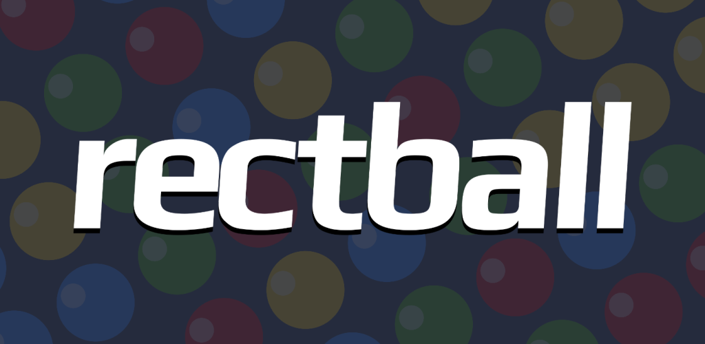

    
    

  

  

Rectball is a colorful puzzle game for Android.
Make selections, clear rectangles and make points before the time runs out.
Rectball is open source and runs on Android 4.0.3+.

You can join the beta on your mobile phone or visiting [this link in your computer](https://play.google.com/apps/testing/es.danirod.rectball.android).

# Contributing

Thank you for your interest in helping to make Rectball better!

Have a suggestion or an idea? Hold it temporally to yourself.
Or carry it to the [discussions](https://github.com/danirod/rectball/discussions), but keep in mind that I won't be addressing feedback until the current roadmap is finished and version 1.0 is finally released.

# Development requirements

Currently, **JDK 17 is required**.
Older versions will not work, newer versions will not work.
The plugins will look for any JDK 17 in the system.
It is suggested that you use the Temurin JDK, but the decision on the vendor is yours.

_(In the future, I'd like to change this behaviour and test the Java versions I accept in my build.gradle files because I honestly still don't know)_

To build Android versions, the Android SDK is required and it should be configured.
**You should not need to install the Android SDK to build the desktop or HTML 5 version; if it fails, it is a bug**.
The build process should work on most host operating systems.

# Gradle projects

* :lwjgl3 - the desktop version (powered by LWJGL 3, runs on most desktop environments)
* :teavm - the HTML5 version (uses TeaVM since Rectball is using Kotlin)
* :android:gpe - the Android Google Play Edition (used to deploy to Google Play)
* :android:osp - the Android Open Source Project (does not use privative components, fully GPL)

# Useful Gradle commands

## PC version

* Run: `./gradlew lwjgl3:run`
* Pack into a JAR: `./gradlew lwjgl3:jar`. Generates .jar in `lwjgl3/build/lib`.
* Create self-contained package: `./gradlew lwjgl3:jpackage`. Generates package in `lwjgl3/build/jpackage`

## Android version

Replace `X` with `osp` for the open source version or `gpe` for the Google Play version.

* Compile open source APKs:
  * Debug: `./gradlew android:X:assembleDebug`, generates .apk in `android/X/build/outputs/apk/debug`
  * Release: `./gradlew android:X:assembleRelease`, generates .apk in `android/X/build/outputs/apk/release`
  * Both: `./gradlew android:X:assemble`, generates .apk in both directories.
* Install in the connected devices (use `adb devices` to check devices):
  * Debug version: `./gradlew android:X:installDebug`
  * Release version: `./gradlew android:X:installRelease`

## Web version

* Create HTML5: `./gradlew teavm:build`, generates output in `teavm/build/dist/webapp`
* Run server: `./gradlew teavm:run`, runs in http://localhost:8080

# Common and known issues

## JPackage cannot pack Rectball ("The first number in an app-version cannot be zero or negative")

JPackage refuses to create an .app for macOS because macOS doesn't let apps have a zero as first version number.
Until I release Rectball 1.0, the workaround is to hardcode version 1.0 when building the application:

    ./gradlew -PversionFamily=1.0 lwjgl3:jpackage

## Application signing on Android

Verify the signatures of the app with `./gradlew android:osp:signatureReport` and `./gradlew android:gpe:signatureReport`.
For the GPE edition, the Google Play Games will not work unless the signing key matches the one uploaded to Google Play Console.

Signing can be done interactively from Android Studio.

When using Gradle, the applications are not signed by default, and must be signed later using `apksigner`:

    apksigner sign --ks [keychain] [path to the APK to sign]

Alternatively, the following four Gradle properties can be injected to sign automatically the generated applications:

* `keysign.storeFile` for the path to the keystore file
* `keysign.storePassword` for the main password of the keystore file
* `keysign.keyAlias` for the key alias in the keystore to use
* `keysign.keyPassword` for the password of the key alias

For instance, in your $GRADLE_HOME/gradle.properties.
If these four settings are set, the signing keys will be automatically configured, and both debug and release APKs will be signed with these.
Again, always check the output of the `signatureReport` task to confirm.

## Google Play Games IDs

For the Google Play edition, the achievement and leaderboard IDs should be downloaded from Google Play Console and placed into `android/gpe/res/values/game-ids.xml`.

This XML file is not confidential (I assume), since these strings are public and placed in the APK anyway, but I prefer to keep this out of the repository to force myself to use fresh data.

# License

Rectball is published under the terms of the GPL v3 (or later) license. Check the [COPYING](COPYING) file.
