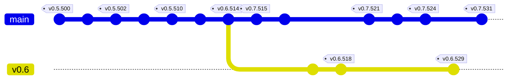
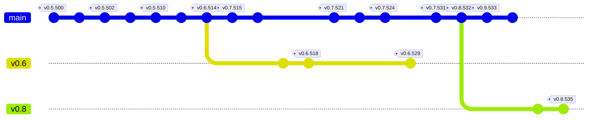
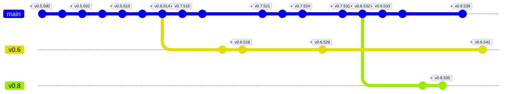

# Git branching model

The model and policy works under the assumption that Git is annoying, difficult
to work with and sometimes breaks. Therefore, I'll keep things simple rather
than being too clever.

The model is inspired by the following existing models:

* The actual GitHub Flow of working on a single branch (I promise).
* The original Git Flow, which used to be a cult in the past, but has seen many
  critics around how difficult is to sync main with develop.
* The FreeBSD Flow, where every version gets not just a Git tag, but a whole
  Git branch for maintenance releases.
* The old Linux kernel Flow, when they used odd-even versions for setting up
  different stability levels of the project.

## Transition schedule

Version v0.5 will be used for transitioning over the new Git model. All the work
will be done in the `master` branch, since new commits between v0.5 and v0.6
will only carry bug fixes and infrastructure changes that do not introduce new
gameplay features.

The new model starts once version v0.6 is released.

## Branching policy

After version v0.6 is released, and a commit is made into the `master` branch
that actually changes the version numbers to v0.6, and the first v0.6.Z release
is properly tagged with the binary artifacts published, a new branch called
`v0.6` will be created. Then a commit will be made into `master` bumping the
version number to v0.7.

At this point, the master branch contains the development code part of the 0.7
branch. This branch contains a work in progress of new features planned for
version 0.8. The branch 'v0.6' contains the stable branch. This branch contains
bug fixes for code already part of this branch.

## Tagging policy

A Git commit simply means a checkpoint to save my work and describe what have I
been working on. A push to GitHub may contain a streak of one or more commits
if I have been worked on a lot of features that night.

Since a build number bump is only done after pushing, it means that a build
number may contain work done on one or more commits. The CI pipeline will
generate nightly artifacts that will make use of that version number. Someone
visiting the GitHub action page may be able to download one of these versions
to try it and I might keep an archive containing all these nightly releases.

However, not every build has to be deployed to Google Play, itch.io or the
website. For instance, maybe the build is broken and doesn't compile for some
or none of the platforms. Or maybe I don't want to deploy an update because
I'd rather wait to have more progress before releasing into the development
channel.

Tags are created only when I decide to release a commit into the appropiate
channel. Those tags have the version number, like v0.5.400 or v0.7.500.

## A graphical example

The following diagram explains this better. (Note: all the build numbers are
invented and may not be real):

Once the development for version 0.7 is done, the same thing happens. A commit
is added to `master` which bumps the version number to 0.8, then a branch called
v0.8 is created from that tip, and the master branch has its version number
bumped to 0.9.

The v0.6 branch will probably never be updated again, although it is kept there
in case something has to be ever ported. For instance, is a prediction about
what is going to happen once I start dropping support for older operating system
versions. If version v0.8 drops support for an Android API, I can use the stale
v0.6 branch to backport a bug fix for those still using an older Android device
where v0.8 cannot be installed but v0.6 can.

## Build numbers

One quick observation is that build numbers only increment through time, but
they don't care about the version family they belong to, which means that it is
possible to have a release for an older version family having a newer build
number than a release for a newer version family, such as the sequence:
v0.6.518, v0.7.521, v0.6.529.

As explained in the Versioning model document, this is intentional and a design
decision, because:

1. The build numbers are provided by a global CI server that builds both the
   stable channel and the development channel.
2. Android apps require a build number to always increment (you can't update to
   an APK that has a lower build number), and Google Play will not allow to
   upload a release to the production channel if it has a lower build number
   than a version in the open beta channel.
